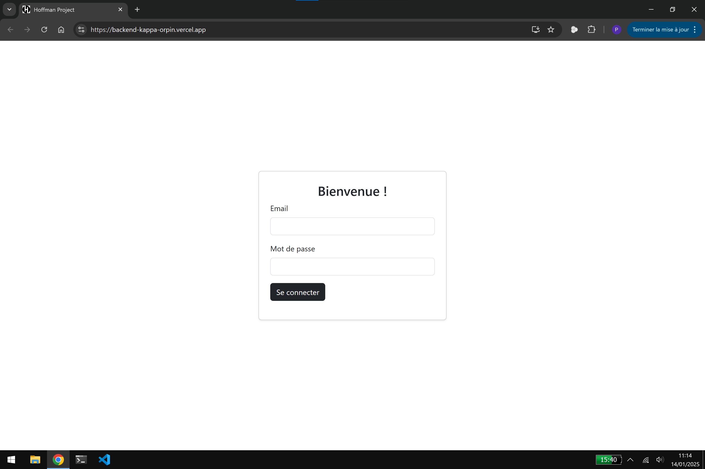
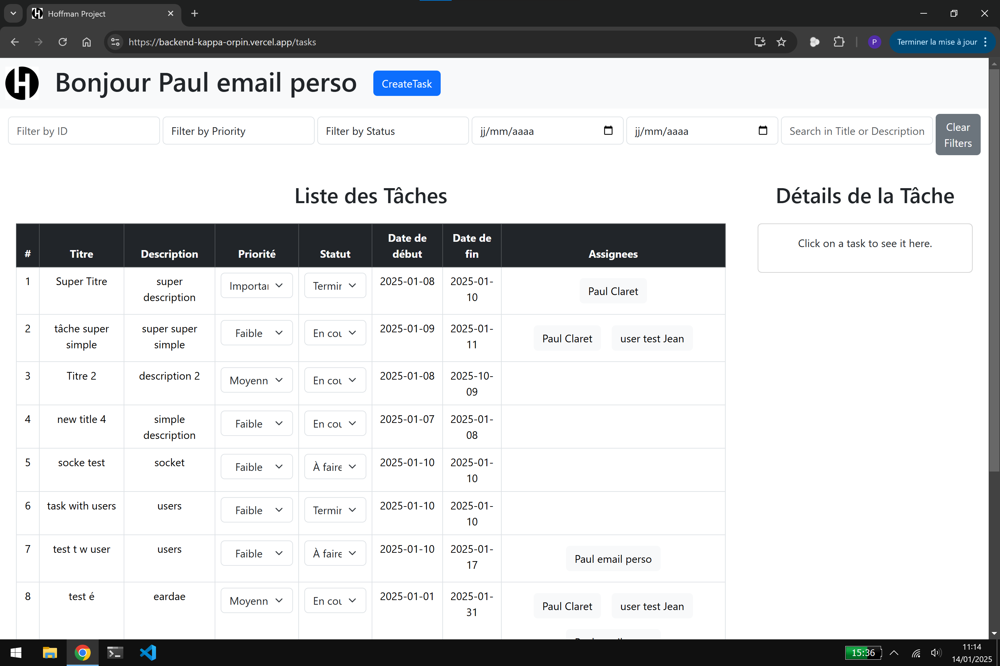
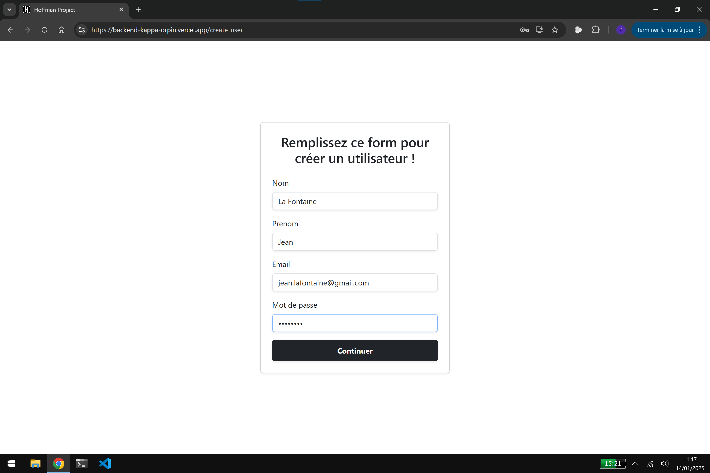

# Hoffmann App Backend

Simple application de gestion de tâche avec ``React``, `express`, `supabase`, `jwt`, `websockets`, `boostrap`...

## ScreenShots & Video

### Photos

|  |  | 
|-------------------------|-------------------------|
|  |  |
|||

### Videos

  

## Build & Deploy

### Méthode 1: submodules (recommandé)

1. Clonez ce repo
2. Vérifiez le contenu du dossier frontend
3. S'il est vide (surement parceque vous avez une version ancienne de git) executez cette commande: `git submodule update --init --recursive`
4. Dans le dossier frontend, executez ensuite la commande `npm install` ainsi que `npm run build`
5. Copiez coller le contenu du dossier `build` (pas le dossier mais son contenu) dans le dossier `public` de ce repo`
6. Lancez `npm install` dans la base `/` de ce repo
7. Deployez sur vercel en suivant ce tutoriel à partir du point 6 pour mettre en ligne: [Vercel, express tutorial](https://vercel.com/guides/using-express-with-vercel#6.-run-your-application-locally)

### Méthode 2: Manuel avec les branches

1. Clonez ce repo
2. Allez dans la branche frontend et lancez `npm run build`.
3. Copiez coller le contenu du dossier `build` (pas le dossier mais son contenu) dans le dossier `public` de ce repo
4. Lancez `npm install` dans la base `/` de ce repo
5. Suivez ce tutoriel de vercel à partir du point 6 pour mettre en ligne: [Vercel, express tutorial](https://vercel.com/guides/using-express-with-vercel#6.-run-your-application-locally)

## Réalisé par

[Paul Claret](https://github.com/paulclrt/)  
[Noa Kaufman](https://github.com/noakau/)
