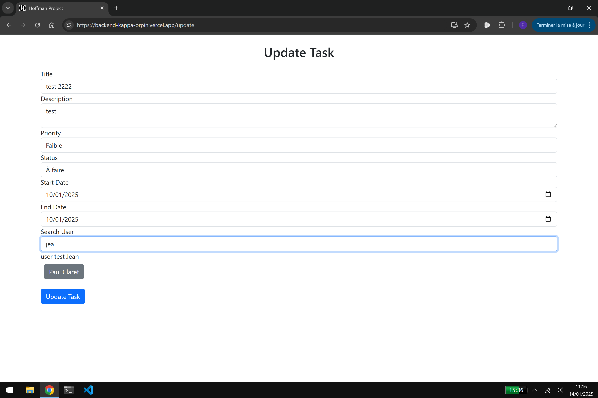

# Hoffmann App Backend

Simple application de gestion de tâche avec ``React``, `express`, `supabase`, `jwt`, `websockets`, `boostrap`...

## ScreenShots & Video

### Photos

|  |  | 
|-------------------------|-------------------------|
|  |  |
|||

### Videos

  

## Build & Deploy

1. Allez dans la branche frontend et lancez `npm run build`.
2. Copiez coller le contenu du dossier build (pas le dossier mais son contenu) dans le dossier public 
3. Lancez `npm install` dans la base `/` de ce repo
4. Suivez ce tutoriel de vercel à partir du point 6 pour mettre en ligne: [Vercel, express tutorial](https://vercel.com/guides/using-express-with-vercel#6.-run-your-application-locally)

## Réalisé par

[Paul Claret](https://github.com/paulclrt/)  
[Noa Kaufman](https://github.com/noakau/)
